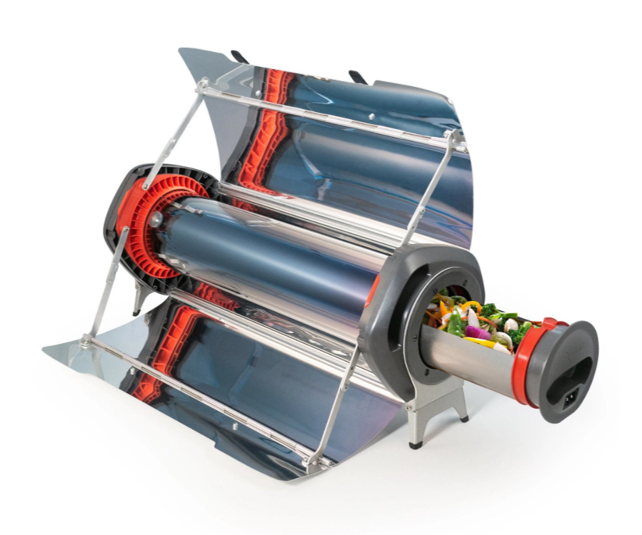
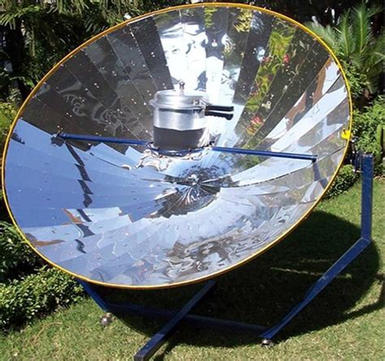
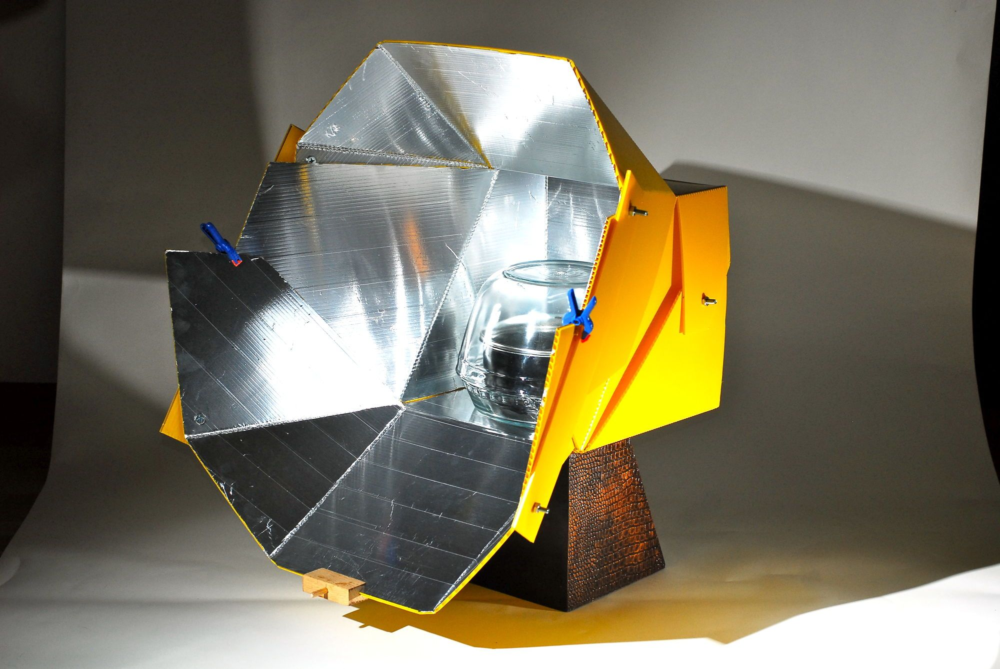
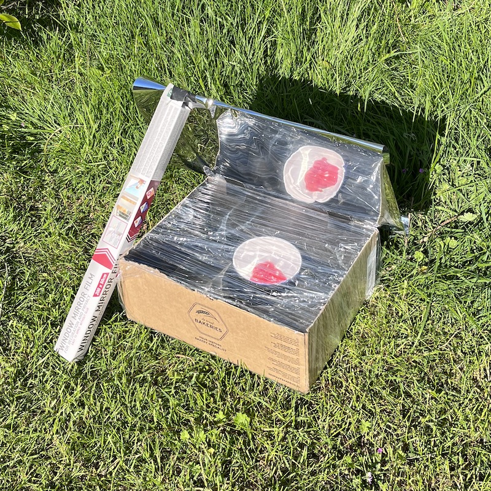

:title: Solar Grill veggie BBQ Workshop
:author: Heerko van der Kooij
:description: 
:css: slides.css

.. header::

  Solar Grill 🌞👩‍🍳🌏🤘 - veggie BBQ Workshop

----

.. :data-scale: 2

===============================
Solar Grill 🥦🌽🍆 BBQ Workshop
===============================

----

.. :data-scale: 1
.. :data-x: r2000
.. :data-rotate-x: r90
.. :data-rotate-y: r90
  

Introduction
=====================

.. note::
  Solar energy is a clean and renewable source of energy that can be used for cooking. Solar ovens are a great way to harness the power of the sun to cook food, while reducing our carbon footprint. While slow cooking, solar ovens can reach temperatures of up to 200 degrees Celsius, making them a viable alternative to conventional ovens.
  
----

:class: large-emoji

Safety
=====================
  🌞🕶️

.. note::
  Safety is of utmost importance when building and using solar ovens. Be sure to take the necessary precautions to ensure a safe and enjoyable experience.

----

Types of Solar Ovens
=============================

- Hybrid Solar Oven
- Parabolic Solar Cooker
- Panel Solar Cooker
- Box-Type Solar Oven

.. note::
  Each type has its own unique design and benefits, so feel free to explore and choose the one that suits your preferences and available resources.

----

Hybrid Solar Oven
=============================

.. note::
  Combines solar energy with other heat sources, providing flexibility in cooking, especially in areas with varying weather conditions.

----

Parabolic Solar Cooker
=============================

.. note::
  Utilizes a curved reflective surface to concentrate sunlight onto a cooking vessel, providing higher temperatures and faster cooking times.

----

Panel Solar Cooker
=============================

.. note:: 
  Lightweight and portable, featuring multiple reflective panels to redirect sunlight onto the cooking area.

----

Box-Type Solar Oven
=============================

.. note:: 
  Simple and easy to build, featuring a box enclosure with a transparent cover and reflective of black interior.

----

Odeillo solar furnace
=============================

.. image:: ./assets/images/Four_solaire_001.jpg

https://en.wikipedia.org/wiki/Odeillo_solar_furnace

----

Reflectors
===================

- Aluminum foil
- Reflective paint
- Mirror / Foil

.. note::
  Efficiently capturing sunlight is essential for effective solar cooking. Consider using reflective materials like aluminum foil or reflective paint to direct and focus sunlight into the oven. Reflectors help maximize the amount of sunlight that enters the oven, enhancing cooking efficiency.

----

Insulation
===================

- Fabric / Clothing
- Paper / Cardboard
- Air / Bubble Wrap
- Natural materials

.. note::
  Insulating your solar oven is crucial for heat retention. Materials such as cardboard or foam boards can be used to insulate the oven. Good insulation helps trap the heat generated by the sun inside the oven, ensuring more efficient cooking.

----

Interior Color
=======================

- Black
- Reflective

.. note::
  The choice of interior color affects the oven's heat absorption and distribution. Painting the inside of the oven black allows it to absorb and retain heat effectively. Alternatively, a white interior or lining with reflective material can help enhance heat distribution within the oven.

----

Clear Cover
====================

Using a transparent cover made of glass or plastic is important to allow sunlight to enter the oven while minimizing heat loss. A clear cover helps create a greenhouse effect inside the oven, trapping heat and aiding in the cooking process.

----

Angles
===================

https://editor.p5js.org/heerko/sketches/MMcy_5gFj

----

Materials and Supplies
===============================

To build our solar ovens, we will need the following materials and supplies:

- Cardboard
- Reflective Foil
- Paint
- Boxes
- Cutting Tools
- Adhesive
- Dutch Ovens

also, maybe?

- thermocouple
- servo's / stepper motors
- LDR's

----

Cook!
===================================

We have supplied some veggies for you to cook with. Let's gather what we can find in the camp and make some delicious food!
Keep in mind that the cooking time will be longer than usual, so be patient and enjoy the process!

----

Go!
===================================

Feel free to think outside the box (hehe) and experiment with different designs, materials, and techniques. 

Planning: 

10:00 Introduction
10:30 Split up in groups 
  
  - Building the ovens
  - Prep food stuffs
  - Electronics?

11:30 Regroup and start cooking

----

Links
===================================

- https://solarcooking.fandom.com/wiki/Solar_Cooking_Wiki_(Home)
- https://www.solarovens.org/recipes/
